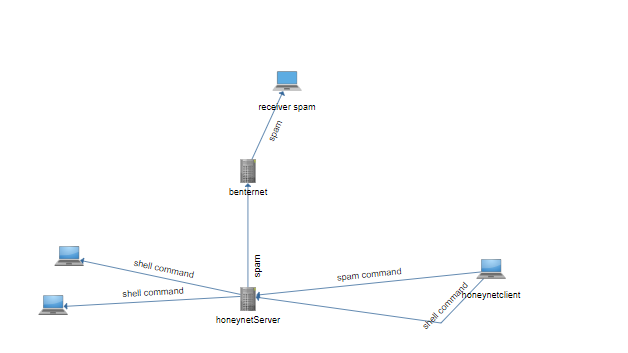
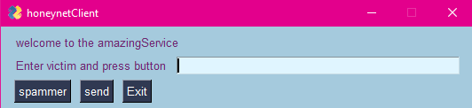

# networkProgramming honeynet
This application is made for bullying other people on a network. 

## How to build
### zmq server 
- mingw gcc compiler 
- zmq library 
    -(https://github.com/zeromq/libzmq) Go to this link 
    - Select version 4.3.4
    - Download the repo 
    - Unzip the library (preferably in root folder)
- Instal cmake (https://cmake.org/)
- Instal pkg-config
    - Go to [http://ftp.gnome.org/pub/gnome/binaries/win32/dependencies/](http://ftp.gnome.org/pub/gnome/binaries/win32/dependencies/).
    - Download the file pkg-config_0.26-1_win32.zip
    - Extract the file bin/pkg-config.exe to C:\MinGW\bin
    - Download the file gettext-runtime_0.18.1.1-2_win32.zip
    - Extract the file bin/intl.dll to C:\MinGW\bin
    - Go to [http://ftp.gnome.org/pub/gnome/binaries/win32/glib/2.28](http://ftp.gnome.org/pub/gnome/binaries/win32/glib/2.28)
    - Download the file glib_2.28.8-1_win32.zip
    - Extract the file bin/libglib-2.0-0.dll to C:\MinGW\bin
 - Build instructions for libzmq 
    - Run the CMake GUI.
    - Set the path to the libzmq directory as source directory.
    * e.g. C:/Users/User1/Downloads/libzmq-4.3.4
    - Set the same path as the build directory and append /build.
    * e.g. C:/Users/User1/Downloads/libzmq-4.3.4/build
    - Press the configure button.
    - CMake will ask you permission to create the build directory. Click Yes.
    - Select the MinGW Makefiles as generator for this project.
    - Click Finish
    - If the configuration is finished then deselect ZMQ_BUILD_TESTS and click Generate.
    - Run a command prompt as administrator from the build directory.
    - Enter the command `mingw32-make -j4 install` and hit enter.
    - If the build is succesful you will see that the directory C:/Program Files (x86)/ZeroMQ is created.
- Now run the cmakelist.txt file 

### python client
- Download python 3.10
- Download pycharm 
- Follow this guide to setup you're IDE https://www.jetbrains.com/help/pycharm/quick-start-guide.html
- In pycharm go to File->setting->project->python interpreter
- click on the plus icon 
- install pyzmq and pysimplegui
### reverse shell 
reverse shell is the same as server.

## functionality

### python client
If you fill in the textfield with a string on which someone is runnig a service and click the spam button it starts spamming them for x amount of time.If you fill in the textfield with a cmd command it will execute on people's pc who have the shell running. The exit button exits the program. 
